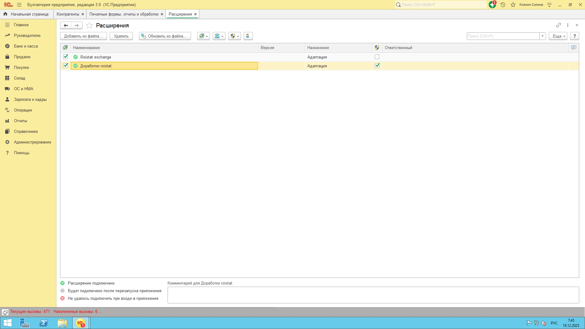
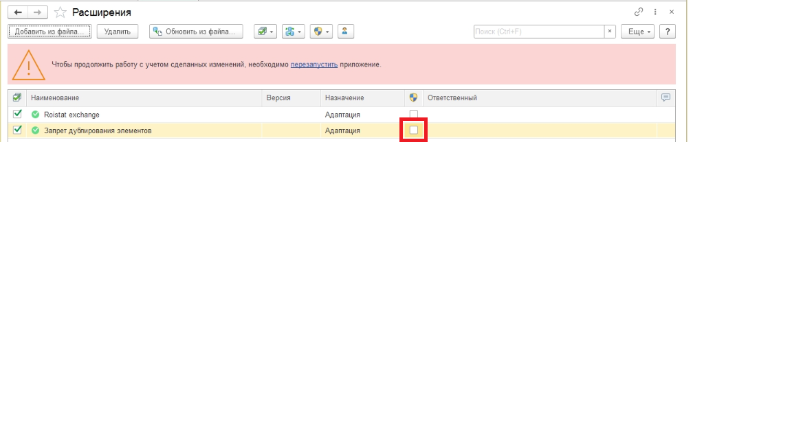

# Доработка по исключению дублей контрагентов и договоров

## Описание

Доработка не позволяет создавать дубли элементов справочников "Контрагенты" и "Договоры контрагентов", а также проводить документы "Реализация товаров услуг", если в тех указаны
контрагент/договор, помеченные на удаление. 

## Ссылка на задачу
> [Задача](https://roistat.platrum.ru/tasks/task/CON-PODKLYUCHENIYA-KLIENTOV-600520)

## Инструкция по внедрению
Пошаговое руководство по внедрению доработки в базу данных

1.  **Шаг 1:** В пользовательской части 1С перейдём в `Расширения` (Администрирование -> Печатные формы, отчеты и обработки -> Расширения) и нажмём на кнопку `Добавить из файла`

2.  **Шаг 2:** При нажатии на кнопку нам предложат выбрать файл для загрузки, выбираем [ЗапретДублированияЭлементов.cfe](ЗапретДублированияЭлементов.cfe) и нажимаем на кнопку `Записать и закрыть`. 
Код модуля объекта документа "Реализация товаров услуг" находится в текстовом файле [РеализацияТоваровУслуг.txt](РеализацияТоваровУслуг.txt).
Код модуля объекта справочника "Контрагенты" находится в текстовом файле [Контрагенты.txt](Контрагенты.txt).
Код модуля объекта справочника "Договоры Контрагентов" находится в текстовом файле [Договоры.txt](Договоры.txt).

3.  **Шаг 3:** Обязательно убираем галку из колонки безопасный режим

4.  **Шаг 4:** Перезапускаем 1С для внесения изменений. Пользователи, которые будут тестировать доработку тоже должны будут перезайти

Теперь при попытке записать договор/контрагента, ИНН и КПП уже зарегистрированы в базе, либо договор с контрагентом, наименование которого уже есть в базе, программа будет
останавливать запись этого элемента и выводить пользователю сначала предупреждение, а после сообщение с пояснением. Это относится и к ручному созданию, и автоматическому обмену.
Также при записи документа Реализация Товаров Услуг, программа будет проверять пометку удаления сначала у контрагента, затем у договора с контрагентом. В случае, если
выбранный элемент помечен на удаление - попытается найти идентичный по реквизитам, но не помеченный элемент. В случае, если не находит - создает новый, заполняет на основании
уже введенного и подставляет в документ, после чего только записывает документ в базу.

